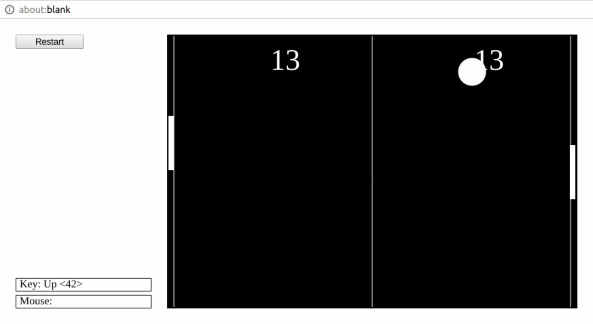

# PythonPong
Pong Arcade Classic written in Python.

## Screenshot

## Technologies Used
- Python 2.6

## Built With
* Sublime Text
* CodeSkulptor

## Author
&copy; 2016 John-Mike Marquardt [Github](https://github.com/codemarq) | [jmmarquardt.com](https://jmmarquardt.com) | [LinkedIn](https://www.linkedin.com/in/jmmarquardt)

## Acknowledgements
- Rice University Intro to Programming in Python, Coursera
- codeskulptor.org (copy and paste pong.py into codeskulptor.org gui to run)

## Future Improvements
- Import appropriate libraries to run in console
- Use Django to run in Browser
